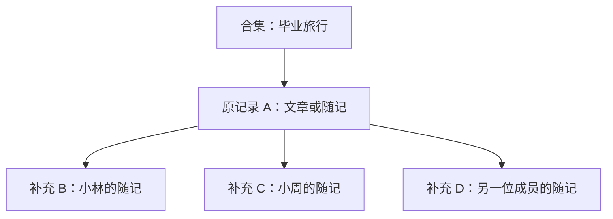

# 共同回忆补全：详细开发方案

日期：2026-09-08  
状态：M0–M4 主流程及 M5 本地门禁已落地；目标 MySQL 迁移、双连接竞态与备份恢复演练仍待完成，详见第 13 节。
范围标识：Shared Memory V1。沿用现有 React + Flask + SQLAlchemy 技术栈。

## 1. 目标与完成标准

**一位合集成员读到朋友的记录后，可以直接补充自己的照片和文字；这些内容保留各自作者，并围绕同一条原记录共同阅读。**

主验收场景：

1. A 在“毕业旅行”合集发布一条看日出的记录。
2. B 打开记录，点击“补充我的视角”。
3. B 上传一张自己拍的照片，写一句话，不必填写标题、Slug 或重新选择合集。
4. B 发布后，页面出现其独立署名的补充；A 收到一条适用其通知偏好的站内通知。
5. C 从 B 的补充进入，仍能找到 A 的原记录及其他人的补充，并加入同一段回忆。
6. 后续修改成员或内容归属时，不出现越权读取，也不会连带删除其他作者的内容。

开发阶段的验收以流程和权限正确性为准；真实使用阶段另观察是否有第二位作者贡献、活动后是否有人重读。两者不能互相替代。

## 2. V1 产品决策

| 项目 | 本方案采用的规则 |
| --- | --- |
| 原记录 | 属于有效合集、当前可读的已发布或已归档 Article / Note |
| 新补充 | 新建一条 Note，使用现有 Post 模型、独立作者、独立媒体和详情地址 |
| 参与者 | 当前合集创建者或成员；原作者也能补充自己的记录 |
| 关联数量 | 一条补充只属于一段共同回忆；一条原记录允许多条补充 |
| 同一作者重复参与 | 允许多次补充；贡献人数按作者去重 |
| 从补充继续参与 | 自动归到最初的原记录；界面不产生多层嵌套 |
| 合集范围 | 原记录和补充必须属于同一个合集；关联不授予额外权限 |
| 发布门槛 | 快速入口支持文字、图片或二者；完整编辑沿用现有 Note 媒体能力 |
| 时间地点 | 原记录为 Note 时带入其明确填写的发生时间、地点，可修改；未填写则留空；Article 不把发布时间当成事件时间 |
| 原内容复制 | 不复制原文、心情、照片或其他作者媒体；源记录摘要仅用于当前授权界面展示 |
| 关系排序 | 原记录单列，补充按首次发布时间升序、Post ID 升序排列 |
| 普通内容排序 | 首页、合集时间轴、归档继续使用现有时间语义，不改变 Feed 游标契约 |
| 删除与归属变化 | 保留其他作者的 Post，按下文状态规则终止或隐藏关联 |

V1 不包含：已有 Post 事后挂入、跨合集引用、多人编辑同一正文、回忆组拆分合并、独立事件管理页、AI 整理、公开分享、PDF 成册、新通知渠道。此前审查中的首页重排、Slug 自动生成和全站搜索升级也不作为本功能的前置任务。

## 3. 用户流程与界面

### 3.1 原记录详情

在 Article 与 Note 详情中接入统一“共同回忆”区块，位于正文及媒体之后、普通评论之前。

无补充时显示一句“你也记得这一刻吗？”和“补充我的视角”。有补充时显示“共同回忆 · 3 人留下了 4 条记录”，其中人数包含原作者，记录数包含原记录；另在补充列表明确显示补充条数。

```text
原记录正文、照片、原有回应

共同回忆                         补充我的视角
3 人留下了 4 条记录

小林 · 补充于 9 月 8 日
那天我们其实差点错过了日出……
[照片]                           打开这条补充

小周 · 补充于 9 月 9 日
这是我从另一边拍的照片。
[照片]                           打开这条补充

加载更多

普通评论
```

卡片优先显示作者、补充文字、首图及首次发布时间；发生时间与补充时间分开标注。图片使用现有授权媒体组件，打开单条详情后继续使用原有完整灯箱。V1 不建设跨作者媒体打包下载或新的跨 Post 灯箱。

### 3.2 快速补充

采用详情页内嵌、可展开的表单，桌面与手机使用同一逻辑。展开后聚焦正文，必要时滚动到表单，避免手机键盘遮住发布区。

表单包含：

- “正在补充：某人的一条记录”，可返回原记录。
- 正文，提示语“留下一句话，或者一张你拍的照片”。
- 添加图片、逐文件上传进度、取消和重试。
- 折叠的发生时间、地点；带入值有“可修改”提示。
- 只读的发布范围：“发布到《毕业旅行》· 当前合集成员可见”；人数只能取授权成员数据。
- “保存并关闭”“完整编辑”“发布补充”。

表单在主动保存、上传或发布时才创建服务器草稿；仅展开浏览不创建空草稿。首次创建后复用同一 Post ID。文字输入按现有短延迟保存到本机；已有服务器草稿时接入现有自动保存契约。

发布时依次完成：等待上传结束 → 保存最新正文和字段 → 带版本号发布 → 读取最新共同回忆列表。只有发布接口确认成功后显示“已补充”，随后定位到新条目。

### 3.3 补充详情

补充仍使用 `/notes/:id`。其共同回忆区块展示原记录摘要及其他补充，当前条目标记“正在阅读”。“补充我的视角”始终指向同一个原记录。

原记录当前不可读时，普通详情完全省略它的标题、作者、ID、缩略图、计数和跳转，不显示会泄露原记录状态的占位信息。补充自身若仍可读，按普通 Note 阅读。

### 3.4 与现有“共同经历”模块的关系

现有 [NoteExperience](/Users/hannn/Desktop/Ying-Mo-V3.2/frontend/src/components/NoteExperience.jsx)由同合集、时间邻近规则驱动。明确区分两个语义：

- “共同回忆”：用户主动建立的本次关联。
- “合集里的前后记录”：现有时间邻近浏览。

将现有区块标题改为“合集里的前后记录”；后端邻近查询排除当前共同回忆内已关联的 Post，避免重复推荐。没有显式关系的普通 Note 继续保留邻近浏览。Article 原有相关阅读继续保留。

### 3.5 完整编辑与退出

“完整编辑”必须先保存同一草稿，再进入 `/write/:postId`。完整编辑器显示关联上下文，关联有效或等待处理期间固定 Note 类型和合集；退出关联后才可按普通草稿切换类型、范围。

关闭表单不会自动发布。若已有文字或服务器草稿，说明“草稿已保留”。上传中的关闭先取消上传、保留已成功绑定的媒体和草稿；不自动删除服务器草稿。

本机缓存按 `userId + rootPostId` 隔离，已创建草稿同时记录 Post ID 与创建请求 UUID。不能复用当前首页唯一的 `quick-note` 缓存键。恢复时先验证账号、草稿所有权和原记录权限，再展示源上下文；源记录正文、摘要、头像与图片不持久化进本机草稿。

## 4. 数据设计

### 4.1 单层关系



这里的连线表示引用关系。每个 Post 的作者、媒体归属、状态和普通访问权仍由现有模型决定。

### 4.2 新增关系表 `post_memory_links`

使用独立关系表，避免给普通 Post 增加多种回忆专用状态。所有列名为本方案拟定，实施时保持契约一致。

| 字段 | 类型与约束 | 用途 |
| --- | --- | --- |
| `id` | Integer PK | 关系标识，内部使用 |
| `contribution_post_id` | FK posts.id，NOT NULL，UNIQUE | 补充 Post；一条补充只有一条关系记录 |
| `root_post_id` | FK posts.id，NOT NULL | 最初的原记录 |
| `collection_id` | FK collections.id，NOT NULL | 建立关系时的合集范围，创建后不变 |
| `author_id` | FK users.id，NOT NULL | 补充作者，用于创建请求幂等约束；必须等于 Post.author_id |
| `client_request_id` | String(36)，NOT NULL | 客户端为一次创建意图生成的 UUID |
| `created_at` | UTC DateTime，NOT NULL | 建立草稿关系的时间 |
| `invalidated_at` | UTC DateTime，nullable | 归属变化、删除等使关系永久失效的时间 |
| `invalidation_reason` | String(40)，nullable | 内部原因，不直接输出给普通读者 |
| `detached_at` | UTC DateTime，nullable | 作者明确解除关联的时间 |

约束与索引：

- UNIQUE(`author_id`, `client_request_id`)：同一创建请求重试只获得同一条草稿。
- CHECK(`root_post_id != contribution_post_id`)。
- 索引(`root_post_id`, `collection_id`, `invalidated_at`, `detached_at`)用于列表和计数。
- 索引(`collection_id`)用于合集删除时的批量关系处理。
- 两个 Post 外键使用 `ON DELETE CASCADE` 清理关系行；删除关系行不会级联删除另一个 Post。已发布记录沿用现有软删除语义。
- Collection 外键使用 `ON DELETE CASCADE` 清理关系行；author_id 使用 `ON DELETE RESTRICT` 保留作者身份约束。

`invalidated_at` 与 `detached_at` 分开，是为了区分“系统检测到原关系已失效”和“作者已经确认将草稿作为普通记录继续处理”。这能避免原记录被移走后，补充草稿静默按另一个含义发布。

### 4.3 服务层不变量

数据库约束以外必须校验：

1. 新补充固定 Note，作者等于当前用户。
2. 原记录与补充的当前 collection_id 都等于关系表中的 collection_id。
3. 原记录不能是仍有未解除、未失效关联的补充；从补充进入时先归一到 root。
4. 原记录需为可读的 published / archived 内容，合集有效，操作者是当前成员。
5. 公共列表、计数和作者聚合只包含当前可读的 published / archived 补充，不包含草稿。
6. `invalidated_at` 或 `detached_at` 一旦设置，不通过版本恢复、移回原合集或管理员恢复隐藏来清空。
7. 隐藏属于动态不可见，不设置永久失效字段；恢复隐藏后仅恢复当前仍合法的关系。

V1 不做历史数据回填，也不自动把时间邻近的 Post 建立为显式关联。

## 5. 权限与生命周期

### 5.1 关系读取条件

关系可展示，当且仅当：关系未永久失效、未解除；合集有效；原记录及补充都在原合集；当前读者分别有权读取两端。

必须在查询层过滤后再分页、计数、聚合作者。不能先查询全部关系，再在前端隐藏。列表卡片、详情、通知和成员导出共用同一套关系判断函数。

作者管理入口只用于处理自己的 Post，不自动获得另一端读取权。对无权读取的普通资源返回项目统一的 404；只在已确认“这确实是你的草稿”后返回可操作的通用冲突信息。

### 5.2 状态处理矩阵

| 事件 | 关系处理 | 对其他内容的影响 |
| --- | --- | --- |
| 建立补充草稿 | 保存关系，但不进入公共列表及计数 | 只有作者可管理草稿 |
| 首次发布 | 重新验证两端、成员和版本，事务提交 | 补充作为普通 Note 进入原有可见页面 |
| 原记录编辑正文、时间或地点 | 保留关系 | 已带入补充的时间地点不自动改变 |
| 原记录或补充归档 | 关系保留；共同回忆可读 | 沿用现有 archived 可读规则 |
| 补充作者被移出合集 | 后续普通请求失去访问权 | 已发布补充仍归作者，其他合法成员仍可读 |
| 原作者被移出合集 | 对该作者失去普通访问权 | 原记录留在合集时，其他成员可继续共同记录 |
| 原记录被隐藏 | 动态隐藏整段关联；停止新建、首次发布 | 各补充自身仍按自己的 Post ACL 读取 |
| 某条补充被隐藏 | 从列表、计数和人数中排除该条 | 其他补充正常显示 |
| 隐藏后恢复 | 当前权限和同合集条件满足时重新展示 | 不恢复已经永久失效或解除的关联 |
| 原记录被删除或移到其他合集 | 所有指向它的关系标记永久失效 | 其他作者 Post 原地保留，不移动、不删除 |
| 补充被删除或移到其他合集 | 该关系永久失效 | 原记录及其他补充保持原状 |
| 合集被删除 | 该合集全部关系永久失效 | 沿用现有规则：内部 Post 脱离为独立 private |
| 作者主动解除补充关系 | 设置 detached_at | 只修改其自己的补充及对应关系 |
| 恢复历史正文版本 | 不从历史快照重建关系 | 若恢复改变合集，必须触发关系失效 |

创建者现有“从合集移除 Post”能力继续适用；原记录作者不因此获得修改或删除其他作者 Post 的权限。V1 不另建“回忆管理员”角色。

### 5.3 编辑途中失权

原记录删除、隐藏、合集变化或成员撤销后：

- 保留作者已写文字、已绑定的本人媒体与草稿。
- 首次发布返回 `409 MEMORY_CONTEXT_UNAVAILABLE`；不偷偷解除关联并发布。
- 页面提供“保留为仅自己可见的草稿”，调用明确的解除接口，设置 `collection_id=null`、`visibility=private`。
- 解除前仍可通过作者入口保存自己的正文；请求不携带未变更的合集或源记录字段。对现有 autosave 的字段处理做针对性适配，避免整包表单导致正文无法保存。
- 错误只说“原记录或参与范围已不可用”，不向失权者区分“被删、被隐藏、被移到哪个合集”。

## 6. API 契约

统一前缀 `/api/v1`，继续使用现有成功与错误 envelope。下例是设计契约，不是已实现接口。

### 6.1 详情扩展

现有 Post 详情额外返回 `memory`。独立 Post 返回 null；合法合集内可作为起点的 Post 即使尚无补充，也返回 `can_contribute`。原关系动态不可见时返回 null，不降级泄露 root 信息。

```json
{
  "memory": {
    "root_post": {
      "id": 101,
      "canonical": "/notes/101",
      "post_type": "note",
      "title": null,
      "content_excerpt": "毕业旅行的第二天，我们看到了日出。",
      "author": { "id": 7, "nickname": "阿青", "username": "aqing" }
    },
    "role": "root",
    "contribution_count": 2,
    "participant_count": 3,
    "can_contribute": true
  }
}
```

`role` 为 `root` 或 `contribution`。所有字段由服务端判断；不接受客户端指定角色。作者草稿详情另返回 `memory_management`，包括 `linked / unavailable / detached` 状态、能否解除和必要操作信息；无权源记录的对象与 ID 保持 null。

### 6.2 读取共同回忆

`GET /posts/{post_id}/memory-thread?page=1&page_size=20`

- 输入可为原记录或合法补充，服务端归一到 root。
- 返回授权 root 摘要、合集摘要、`contribution_count`、`participant_count`、`can_contribute`、`composer_defaults`、`items` 与现有 `meta.pagination`。
- `items` 只放补充，root 单独显示；`page_size` 默认 20，上限 50。
- `composer_defaults` 仅含允许带入的 `occurred_at`、`location`；Article 对应 null。
- 支持 `focus_post_id`：与显式 page 互斥。先确认它是可读的本组补充，再计算所在页并返回，供发布成功后或深链接定位；不可读目标统一 404。
- 原记录存在但零补充时返回正常空列表；无权输入、隐藏原记录、无效分组统一 404；可读但独立的普通 Post 返回 `422 MEMORY_NOT_ELIGIBLE`。

### 6.3 创建补充草稿

`POST /posts/{post_id}/memory-contributions`

```json
{ "client_request_id": "c5942f1e-3f1a-4d43-8b52-4de164686f85" }
```

仅接受上述字段；Post 类型、作者、合集、根记录以及默认时间地点由后端读取并决定。客户端编辑后的文字和时间地点，在创建成功后通过现有 PATCH 保存。

- 在同一事务中创建 Note 草稿及关系；失败全部回滚。
- 首次创建返回 201 与作者草稿详情，包括 `edit_version`；相同用户、UUID、归一后的原记录重试返回 200 与同一草稿。
- 同一 UUID 被用于不同原记录返回 409，且不披露原请求的对象信息。
- 幂等保证限定于关系行存续期，包括草稿、已发布和关系失效后的留存阶段。V1 不新增创建请求墓碑表；草稿物理删除后，对应关系行也删除，服务器无法识别该旧 UUID。客户端在主动删除草稿时取消待发送请求、清除旧 UUID，并禁止重放该创建意图；不承诺跨物理删除的幂等性。
- 对已存在的相同请求，允许作者在失权后取回自己的草稿管理信息，但源对象脱敏；对全新请求仍严格检查当前成员资格。
- 同 UUID 并发依赖数据库唯一约束兜底，不只靠前端按钮禁用。只捕获命中该唯一约束的冲突，不能把其他 IntegrityError 当作请求重试。

### 6.4 保存、媒体与发布

保存、预览、上传、绑定、下载继续使用现有接口，媒体绑定目标始终是补充者自己的 Note。

现有 `POST /posts/{id}/publish` 为关联补充新增必填 `expected_version`；普通 Post 保持原契约。草稿在完整编辑器中也必须走同一分支。

```json
{ "expected_version": 4 }
```

首次发布必须在事务中完成：确认本人草稿 → 按统一顺序取得锁并重新读取状态 → 检查合集、root、关系、成员 → 检查 expected_version → 校验有效的 Note 内容 → 更新 Post → 写入通知 → 提交。上下文失效优先返回通用关联冲突，避免作者误以为只要覆盖正文版本就能发布。

重复提交已成功的同一补充，应返回当前已发布结果，不重置首次发布时间、不重复通知；这次请求不携带新正文，因此不得顺便覆盖任何内容。对尚未发布的版本冲突仍返回现有 `EDIT_CONFLICT`。

### 6.5 作者解除关联

`POST /posts/{contribution_id}/memory-link/detach`

```json
{ "expected_version": 4, "destination": "private" }
```

`destination` 两个合法值：

- `private`：解除关联，同时将自己的 Post 移出合集为 private；失权后处理草稿使用此值。
- `keep_collection`：只解除关联、保留所属合集；仅当前合集成员可选，且必须检查当前合集有效。

只允许补充作者调用，包括作者目前已失去合集普通读取权的情况。解除发生在单个事务中，并推进 Post 的 `edit_version`。同一目标状态下重复请求可幂等返回；目标状态不同或版本冲突不得静默执行。解除后通过现有编辑器处理为普通记录。

### 6.6 错误约定

| 情况 | 响应 |
| --- | --- |
| 未登录 / 账号受限 | 沿用 401 / 403 |
| 普通请求无权访问任一必要资源 | 404 RESOURCE_NOT_FOUND |
| 可读独立 Post、非法字段、非法类型 | 422 VALIDATION_ERROR 或 MEMORY_NOT_ELIGIBLE |
| 作者草稿关联上下文已不可用 | 409 MEMORY_CONTEXT_UNAVAILABLE |
| 未解除关联就更改草稿合集、类型或扩大受众 | 409 MEMORY_SCOPE_LOCKED |
| 作者保存或发布的版本冲突 | 409 EDIT_CONFLICT |
| UUID 对应另一创建意图 | 409 IDEMPOTENCY_CONFLICT |

## 7. 后端实现与并发

### 7.1 模块边界

新增服务模块 `backend/app/posts/memory_contributions.py`，集中负责：归一 root、关系查询、作者管理 DTO、幂等创建、发布前校验、通知收件人决策、关系失效和解除。对应新模型放在 `backend/app/models/memory.py` 并注册进 models 初始化模块。

不要在 `Post.to_dict()` 中直接输出关系表内容。普通 Post 序列化不知道当前请求者，容易把 root ID 或失效来源带到首页、管理页等表面。关系信息必须由带 `actor_id` 的专用序列化函数产生。

### 7.2 写路径覆盖清单

现有多个入口会直接改变 collection_id 或 deleted_at，必须统一调用关系处理服务：

| 现有位置 | 接入点 |
| --- | --- |
| `backend/app/posts/routes.py` | PATCH、autosave、publish、move-collection、remove-from-collection、作者 delete |
| `backend/app/posts/service.py` | apply_collection、publish_post 的关联校验和首次发布通知分支 |
| `backend/app/collections/routes.py` | 创建者 remove-post、成员变更入口 |
| `backend/app/collections/service.py` | delete_collection、replace_members、创建者转让的共同锁规则 |
| `backend/app/admin/routes.py` | Post 删除、Post / Collection 隐藏恢复、Collection 删除 |
| `backend/app/posts/revisions.py` | 恢复前后比较合集，变化时使关联永久失效；不把关联写入可恢复快照 |

原记录移出时批量处理指向它的关系；补充移出时只处理自身关系。仅修改正文、图注、位置或标签不应误触发失效。草稿的有效关联范围不能被普通 PATCH 绕过。

### 7.3 并发事务

生产数据库上，需要让补充创建、首次发布与成员撤销、原记录移动、删除使用同一个合集行锁协议。**只给新接口加锁不能阻止旧入口与其竞态。**

- 锁顺序统一为相关 Collection ID 升序 → 涉及的 Post ID 升序 → 关系行。
- 跨合集移动同时锁旧合集与新合集；取得锁后重新读取成员、状态和归属，不能使用锁前缓存的 ORM 对象作最终权限判定。
- 原作者、补充作者的内容编辑继续使用 Post.edit_version；单纯增加其他人的补充不修改原记录的 edit_version，避免打断其正文编辑。
- 修改、失效、解除一条关联时同步推进对应补充 Post 的版本，特别是正在编辑的草稿；批量更新必须显式处理版本及 ORM 同步。
- 新建 UUID 唯一约束与首次发布的 Post 行锁分别解决重复建稿和重复通知。
- 业务事务提交后的后续请求必须服从新权限；不承诺撤回用户此前已经看到或保存的内容。

SQLite 测试用于逻辑正确性，不能证明 MySQL 行锁竞态通过。正式开放前应在目标数据库使用两个独立连接验证“发布与移除成员”“发布与原记录移动”“同 UUID 并发创建”。

### 7.4 通知

新增 `memory_contribution_added`，通知目标为新发布的补充 Post。数据库保存通用文案，读取时在权限允许范围内生成“某人补充了这段共同回忆”和摘要。

- root 作者仍是有效成员且不是本次补充者时，发送该通知。
- 其他成员继续按现有 `collection_new_post` 规则接收投稿通知。
- root 作者从普通投稿收件人集合剔除，同一次发布每人最多收到一种通知。
- 新 kind 加入“仅重要”允许列表，但不加入不可静音的直接成员变更列表：`all` 接收、`important` 接收、`muted` 不接收。
- 保存草稿、编辑、归档后再次发布不重新通知；不向自己发通知。
- 通知列表和标记已读响应都重新校验关系两端。关系已失效、解除或不可读时返回通用文案，清空源相关 actor、摘要、Post / Collection ID 与跳转，避免当前通知序列化中的合集回退链接绕过新关系语义。

有效目标使用补充的 `/notes/:id#shared-memory`，在详情加载后定位区块。不新增推送、邮件或轮询机制。

## 8. 前端实现清单

建议新增：

| 文件 | 职责 |
| --- | --- |
| `frontend/src/components/SharedMemorySection.jsx` | 同一段回忆的 root、参与信息、补充列表、分页和入口 |
| `frontend/src/components/MemoryContributionComposer.jsx` | 内嵌表单，固定范围、关联状态和恢复流程 |
| `frontend/src/hooks/useNoteDraft.js` | 提取可复用的草稿保存、上传及重试逻辑；首页与新表单共用 |
| `frontend/src/lib/memoryContributions.js` | 请求构造、上下文缓存键、UUID 创建意图、错误映射、定位 |
| `frontend/src/styles/shared-memory.css` | 手机单列、桌面内容宽度、轻量卡片和展开表单 |

调整现有：PostDetailPage 的两种详情分支；QuickNoteComposer 的通用逻辑复用；WritePage 的关联草稿上下文与发布版本号；NoteExperience 名称与排除逻辑；通知展示与导航；必要的离线草稿处理。

抽取范围以实际共用的保存、上传和重试逻辑为限，保持现有首页行为。不要复制整个 QuickNoteComposer，也不要顺带重写整个 WritePage。

状态要求：

- `loading / ready / saving / uploading / publishing / conflict / context_unavailable / published` 明确区分。
- 服务端成功之前不把临时内容计入公共人数、条数；可显示只对本人可见的“正在发布”。
- 在首次创建请求前生成并持久化 UUID；网络失败沿用该 UUID。发布成功或作者明确删除后清除该创建意图，下一次补充生成新的 UUID。
- 发布响应丢失后，先查询已知 Post ID 的作者状态；已发布则收敛成功，否则保留原草稿重试。
- 发布成功、解除或失效后刷新当前共同回忆数据；不得强制把首页返回位置重置到顶部。
- 新补充出现在首页和合集时间轴中的位置服从已有排序。补写旧时刻时可能位于较早位置，因此成功后定位共同回忆里的新条目，而不是承诺它成为首页第一条。
- 401 清理当前账号页面状态；404 清除缓存的来源内容；当前会话恢复焦点或重新打开表单时重新检查上下文。
- 暂存本人文字不等同于离线访问朋友内容；Service Worker 继续不缓存 API 和受保护媒体。

无障碍及移动验收：按钮有明确名称；上传与发布状态使用 aria-live；展开后焦点合理、关闭后回到触发按钮；320 / 390 / 768 / 1440 宽度无横向溢出；长昵称、无标题、纯图片、深色和键盘操作均可用。

## 9. 导出、备份与迁移

### 9.1 迁移

当前代码中的 Alembic head 是 [20260904_0012](/Users/hannn/Desktop/Ying-Mo-V3.2/backend/migrations/versions/20260904_0012_media_presentation.py:11)，不同于部分旧交接文档中的 0011。新增下一条迁移，实施开始时再次确认 head，避免编号冲突。

迁移只新增关系表及必要索引约束，不改变现有 Post、作者或媒体数据。先验证空库升级，再验证已有内容库从当前 head 升级。降级在隔离数据库验证：移除关系结构不应删除任何 Post 或媒体。

### 9.2 成员导出

在现有导出包增加可选的 `memory_links.json`：只导出“补充 Post 属于本人，且本人当前可读关系两端”的有效关联，包含自身 Post ID、可读 root ID 与合集 ID；不扩展为导出 root 的他人正文或媒体。

失效、已解除或失权关系不输出来源标识；本人 Post 仍按原有导出规则保存。root 是本人而补充属于别人时，也不因此导出别人的记录。新增文件与清单计数保持向后可忽略的扩展方式，并写明其结构版本。

### 9.3 备份兼容

现有 [backup.py](/Users/hannn/Desktop/Ying-Mo-V3.2/backend/app/backup.py)按 metadata 导出所有表，新增模型注册后可以纳入完整备份；但校验要求备份表集合与当前模型完全一致。

因此，本期需验证新 schema 下备份—校验—恢复保留所有关联及失效状态，并验证恢复后的关系不变量。旧 schema 的备份沿用“在匹配旧版本的隔离环境恢复，再升级迁移”的流程，不直接宣称能导入新版本。发布记录保存代码版本、迁移 head 和匹配的备份路径。

## 10. 分阶段任务与验收

所有任务在本项目内推进，不需要另建应用。以下工时是单人熟悉代码情况下的粗略开发量，合计约 10–15 个工作日；不包含等待真实使用反馈，不能作为交付日期保证。

| 阶段 | 预计 | 交付与退出条件 |
| --- | --- | --- |
| M0 契约收口 | 0.5–1 天 | 将本功能正式规则同步到现有 product.md；确认源记录与草稿状态、接口错误与迁移 head；整理隔离数据场景 |
| M1 模型和关系读取 | 1.5–2 天 | 模型、迁移、统一 ACL、root 归一、列表 / 计数 / 详情；多账号读取测试通过 |
| M2 草稿与发布闭环 | 2–3 天 | 幂等创建、版本化保存发布、解除接口、图片复用；仅用 HTTP 即可完成图文补充与恢复失败 |
| M3 生命周期完整化 | 2–3 天 | 所有归属变更入口、删除、隐藏恢复、历史恢复、并发锁、通知去重与脱敏；失权矩阵通过 |
| M4 前端体验 | 2–3 天 | 原记录与补充详情、内嵌表单、完整编辑、恢复和新条目定位；桌面与手机真实浏览器验收 |
| M5 发布准备 | 1.5–3 天 | 导出与备份、迁移演练、目标数据库竞态、全量门禁、交接文档；具备小范围开放条件 |

M2 完成可用于本地联调演示；M3 与 M5 未完成前，不向真实成员开放写入。每阶段单独保持可验证的变更范围，不混入首页视觉改版、全站分类优化或依赖升级。

建议实施的第一个任务：**新增关系模型和迁移，实现带 ACL 的 root 归一与回忆列表；先用测试数据验证 A、B 可读、C 不可读及草稿不计数。**

## 11. 测试与验收清单

新增后端用例集中于 `test_memory_contributions.py`、`test_memory_contribution_acl.py`、`test_memory_contribution_lifecycle.py`；迁移、通知、导出和 Revision 的交叉行为补到对应已有测试中。

| 编号 | 必验行为 |
| --- | --- |
| T01 | Article 和 Note 均可成为 root；独立 private / login_only Post、draft、隐藏、删除或失权 root 不可作为入口 |
| T02 | 从有效补充再次补充得到同一个 root，没有自关联、跨合集或多层嵌套 |
| T03 | 纯文字、纯图片、图文均可发布；空表单不可发布；非法或他人媒体不可绑定 |
| T04 | Note 的明确发生时间 / 地点正确带入，Article 不用发布时间冒充发生时间；用户能修改 |
| T05 | 同人多次补充合法；条数与去重人数口径正确；草稿不进入列表、计数或通知 |
| T06 | 同 UUID 重试与并发只创建一个 Post；不同 root 复用 UUID 冲突；草稿删除后的客户端不重放旧请求 |
| T07 | 非作者不能改写、删除或解除补充；root 作者和管理员普通身份也不能绕过作者权限 |
| T08 | 上传后取消、单文件失败重试、发布失败均保留正确的本人草稿与媒体；完整编辑接续同一 ID |
| T09 | 发布前原记录隐藏 / 删除 / 移动、合集删除、成员撤销均失败且保留草稿；无来源信息泄露 |
| T10 | 失权作者可保存自己的文字并解除为 private；普通完整表单不能绕过固定合集和类型 |
| T11 | 原记录正文编辑不改其他人的补充；编辑时间地点不重新覆盖已保存草稿 |
| T12 | root 移出或删除保留全部其他 Post；补充移出只影响自身；移回、历史恢复均不恢复永久失效关系 |
| T13 | 隐藏与恢复只动态影响合法关系；已失效或解除的关系不复活；归档仍可按现有规则阅读 |
| T14 | 成员被移除后，详情、列表、分页、计数、作者聚合、通知、导出和媒体后续读取服从现有权限 |
| T15 | 创建者移除 Post、作者直接 PATCH、专用移动接口、管理员删除、合集删除、Revision 恢复全部触发对应关系逻辑 |
| T16 | 两端被隐藏或失权时，作者管理 DTO、普通详情与通知均不泄露 root ID、正文、作者、图或目标 URL |
| T17 | all / important / muted 偏好正确；原作者每次首次补充最多一条通知，无自通知、无重发 |
| T18 | publish 响应丢失后按 Post 状态收敛成功；版本冲突不覆盖文本；并发发布不重复通知 |
| T19 | 分页排序稳定、focus_post_id 定位正确、失权 focus 不可枚举、空页可回收；原邻近模块不重复展示组内成员 |
| T20 | 当前用户 / root 的本机草稿互相隔离；退出账号再登录他人不串草稿；源正文与媒体不写本机恢复数据 |
| T21 | 新表迁移不破坏旧 Post；新备份恢复保留关系；旧备份不误报兼容；成员导出不扩张到他人数据 |
| T22 | MySQL 双连接竞态：发布对成员撤销、发布对 root 移动、同 UUID 创建的结果符合事务先后顺序 |
| T23 | 浏览器用不同账号完成发起、补充、通知跳转、继续补充、编辑和失权；主流程使用真实后端，不用模拟响应替代 |
| T24 | 320 / 390 / 768 / 1440、浅深色、无标题、纯图片、长文、键盘焦点、离线恢复、首页返回位置均正常 |

计划执行的门禁：

```bash
# 工作目录：/Users/hannn/Desktop/Ying-Mo-V3.2/frontend
npm run check
npm run test:e2e -- e2e/memory-contributions.spec.js e2e/home.spec.js e2e/editor.spec.js

# 工作目录：/Users/hannn/Desktop/Ying-Mo-V3.2/backend
.venv/bin/python -m pytest -q
.venv/bin/python scripts/verify_static.py

# 工作目录：/Users/hannn/Desktop/Ying-Mo-V3.2
git diff --check
```

按已有验证脚本的最新约定补齐完整 HTTP 验收、迁移和目标基础设施检查。本次只制定方案，上述新增测试与命令结果均未产生。

## 12. 开放、回退与观察

增加服务端创建开关 `MEMORY_CONTRIBUTIONS_ENABLED`，默认关闭。它控制新建补充和入口能力；已有补充仍是普通 Post，关系的读取、失效维护和作者管理在关闭开关时继续正常工作。

部署顺序：迁移 → 部署包含所有生命周期维护的后端 → 部署前端 → 隔离冒烟 → 对受邀试用范围开放创建。若站点已有真实数据，先按现有发布要求准备匹配版本的备份。

出现问题时先关闭创建开关，保留新 Post 和关系数据，不用数据库降级作为日常回退手段。若必须退回完全不认识关系表的旧后端，应先暂停相关写入并制定数据处理方案，否则旧入口移动 Post 后不会维护新关系。本文不执行部署。

小范围试用选一件真实共同经历，邀请 3–5 人完成图文补充。记录“能否独立完成、哪里求助、是否第二次补充、七天后是否回来”；首轮通过现有数据及人工观察统计，无需增加行为画像系统。

## 13. 与当前仓库的对应及实施状态

方案依据的主要现有代码：

- [访问控制](/Users/hannn/Desktop/Ying-Mo-V3.2/backend/app/access.py)
- [Post 路由与草稿、发布、移动](/Users/hannn/Desktop/Ying-Mo-V3.2/backend/app/posts/routes.py)
- [发布及合集投稿通知](/Users/hannn/Desktop/Ying-Mo-V3.2/backend/app/posts/service.py)
- [现有邻近共同经历](/Users/hannn/Desktop/Ying-Mo-V3.2/backend/app/posts/note_experience.py)
- [合集成员与删除语义](/Users/hannn/Desktop/Ying-Mo-V3.2/backend/app/collections/service.py)
- [通知偏好](/Users/hannn/Desktop/Ying-Mo-V3.2/backend/app/notifications/service.py)
- [快速随记](/Users/hannn/Desktop/Ying-Mo-V3.2/frontend/src/components/QuickNoteComposer.jsx)
- [详情页](/Users/hannn/Desktop/Ying-Mo-V3.2/frontend/src/pages/PostDetailPage.jsx)
- [离线草稿键与存储](/Users/hannn/Desktop/Ying-Mo-V3.2/frontend/src/lib/offlineDraft.js)

截至 2026-09-08，M0–M4 的主流程和 M5 的本地发布门禁已经落地：关系模型与迁移、ACL 安全读取、幂等草稿、版本化发布、关系失效与解除、通知、成员导出、详情内嵌表单、完整编辑接续、移动端真实后端验收均已实现。服务端创建开关默认关闭，测试环境显式开启；开放给真实成员前仍需在目标 MySQL 环境完成迁移、双连接竞态和备份恢复演练，并按第 12 节配置小范围试用。
